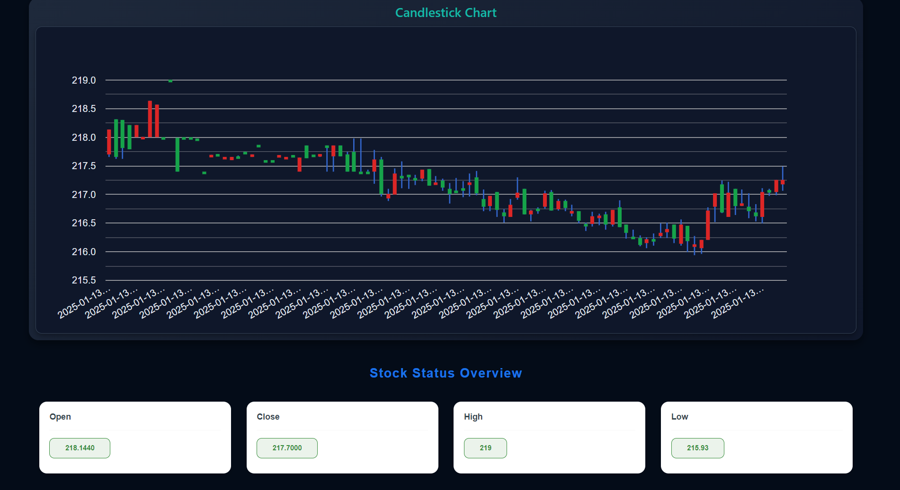
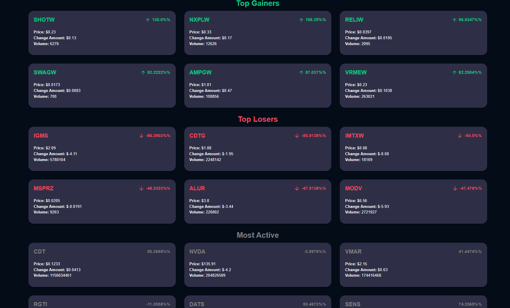
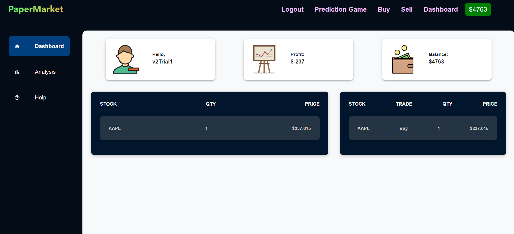

# **PaperMarket**

---

## **Introduction**
Investing in the stock market is a powerful tool to beat inflation and achieve exponential returns. However, for beginners, trading platforms can feel overwhelming, posing risks to their savings.  

**PaperMarket** bridges this gap by providing a secure and intuitive **paper trading platform**. It simulates real trading experiences, enabling users to learn, analyze, and gain confidence without risking their money.

---

## **Key Features**

### **1. Real-Time Stock Updates**
- Track live stock performance and market trends.
- Analyze stocks using **candlestick charts** for an authentic trading experience.
- Stay informed with up-to-the-minute market data.

---

### **2. Stock Analysis**
- Explore detailed stock profiles based on:
  - Previous trends and calls.
  - Market volume and caps (upper/lower limits).
- Understand overall market conditions (bearish/bullish trends) to make informed decisions.

---

### **3. Enhanced Security**
- Secure storage of confidential user data (passwords, transaction history, and trades) on private servers.
- Profile data is encrypted and accessible only after sign-in.
- Ensures secure transfer of user trades to deliver reliable and authentic results.

### **4. User Dashboard**
- Intuitive interface displaying key stats like:
  - Current portfolio value.
  - Recent transactions and trade history.
  - Personalized stock suggestions and alerts.

---

## **Why Choose PaperMarket?**
- **Learn by Doing**: Experience trading with a real-time simulated environment.
- **Safe Space**: Avoid the risk of losing money while gaining confidence.
- **Intuitive Interface**: Simplified and user-friendly design.

---

## **Tech Stack**
- **Frontend**: HTML, CSS, React.js, MUI.
- **Backend**: Node.js, Express.js.
- **Database**: MongoDB.
- **Security**: JWT.

---

## **Challenges Faced**
1. Plotting candlestick charts:
   - Researched and utilized appropriate libraries for accurate representation.
2. API Integration:
   - Identified and integrated reliable APIs for real-time data.
3. Security:
   - Implemented encryption for sensitive user data and ensured secure trade transfers to prevent unauthorized access.

---

## **About This App**
- Register using your email to create a secure account.
- Learn trading by analyzing stock trends through interactive charts.
- Fully encrypted and secure platform.

---
